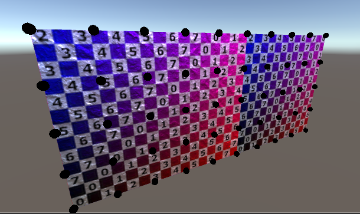

# Mesh

An introduction to procedural meshes. From a simple grid to deformable balls.

## Procedural Mesh

Topics

* Create a grid of points.
* Use a coroutine to analyze their placement.
* Define a surface with triangles.
* Automatically generate normals.
* Add texture coordinates and tangents.

Based on 
